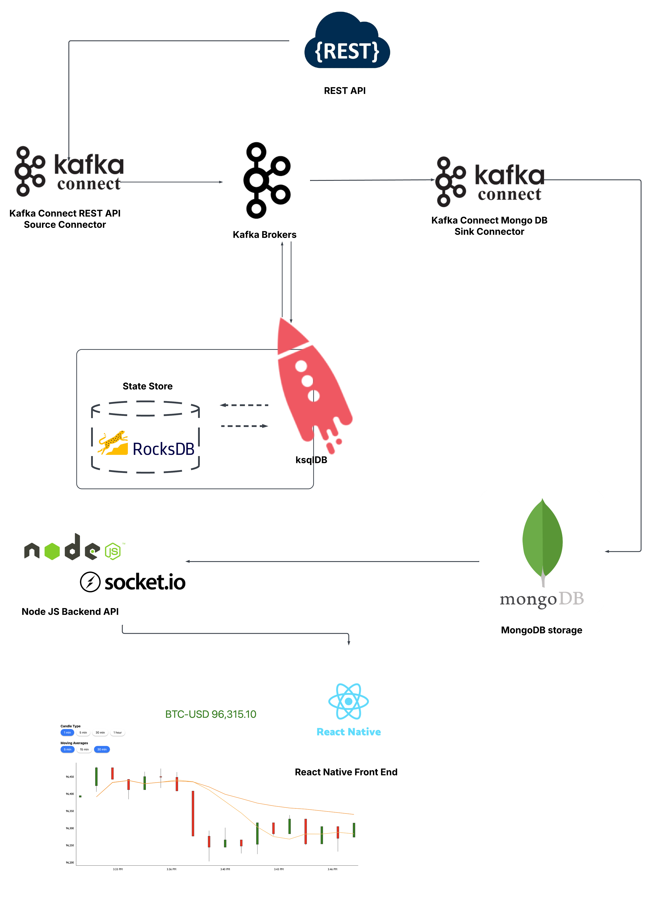
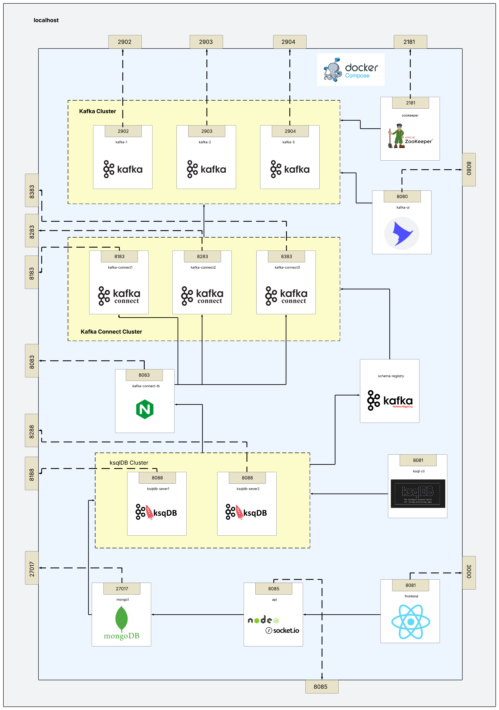

# RealTime Bitcoin charting with Kafka
The purpose of this app is to showcase how you can use Kafka for a real time data processing pipeline.


## What does it do?
Simplifying the pipeline: it is requesting the price of Bitcoin from a REST API every second and uses this data to process in real time statistics that are plotted on a UI as soon as they appear.



## What tools is it using?
For data processing purposes, it is mostly using Kafka ecosystem tools like Kafka for storage, Kafka Connect for out of Kafka connections and ksqlDB (Kafka Streaming with SQL) for real time data processing. 
Here's a complete list:
**Zookeeper** for Kafka cluster management
**Kafka** for data stream storage
**Kafka UI** to visualize topics, messages, brokers
**Kafka Connect** for writing and reading Kafka topics 
**Kafka Schema registry** to store message schemas
**ksqlDB** and implicitly Kafka Streaming for real time data processing
**ksqlDB CLI** to interact the ksqlDB cluster and send SQL jobs
Aside from the above, it is also using:
**Nginx** for load balancing ([the real reason for this load balancer is to provide a fail tolerant method for the ksqlDB servers to connect with any of the Kafka Connect workers ](https://github.com/confluentinc/ksql/issues/7527))
**MongoDB** NoSQL database to sync statistics.
**NodeJS** to host a web socket that provides the application with a real time API
**ReactNative** application UI for plotting candle and line charts



## How to run it?
You can run the app locally using docker compose.
Start the app using:
```
docker compose up -d
```
Stop the app and remove volumes:
```
docker compose down --volumes
```

## Application Endpoints
Applicaton UI http://localhost:3000 \
KafkaUI http://localhost:8080 \
KafkaConnect load balancer: http://localhost:8083 \
KafkaConnect worker1: http://localhost:8183 \
KafkaConnect worker2: http://localhost:8283 \
KafkaConnect worker3: http://localhost:8383 \
ksqlDB Server worker1: http://localhost:8188 \
ksqlDB Server worker3: http://localhost:8288
